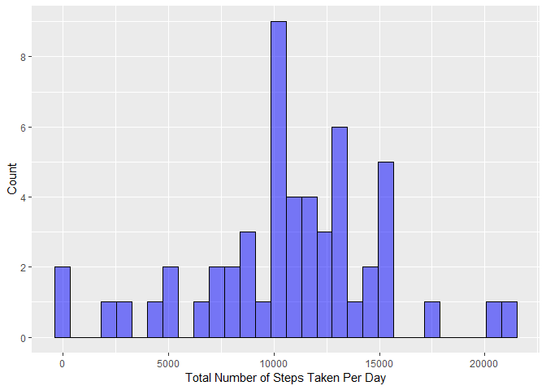
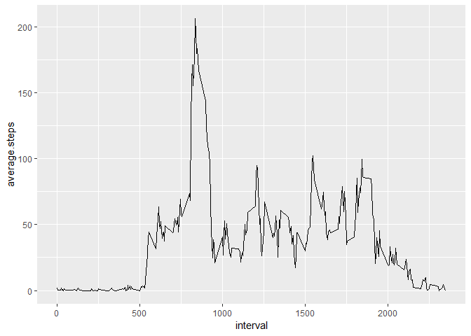
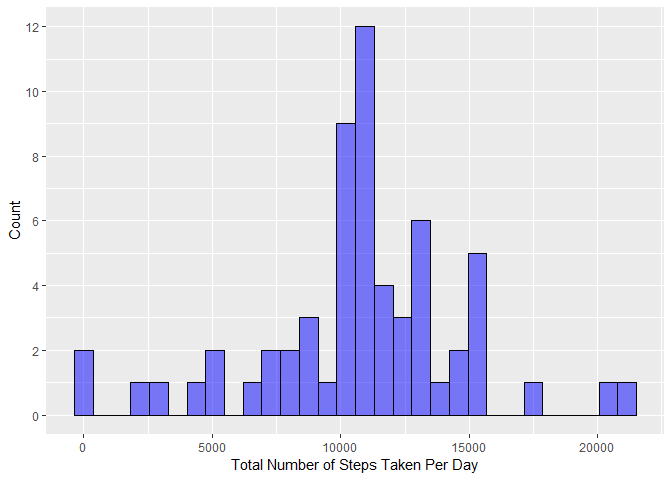
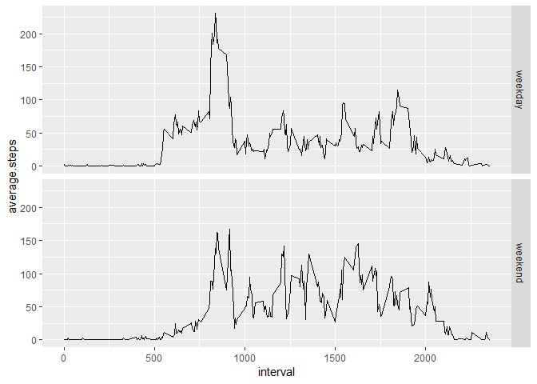

##Load the data into R

```r
library(dplyr)
library(ggplot2)
df<- read.csv("./activity.csv")
```

##1.What is mean and median total number of steps taken per day?
        
###1.1. Calculate the total number of steps taken per day


```r
df1<- df %>% group_by(date) %>% summarize (total.steps=sum(steps))
```
###1.2. Make a histogram of the total number of steps taken each day

```r
	ggplot(data=df1, aes(df1$total.steps)) + 
				geom_histogram(col="black", fill="blue", alpha = .5) +
				scale_x_continuous(name="Total Number of Steps Taken Per Day")+
				scale_y_continuous(name="Count", breaks=seq(0,10,2))
```

```
## Warning: Removed 8 rows containing non-finite values (stat_bin).
```

<!-- -->

###1.3. Calculate and report the mean and median of the total number of steps taken per day

```r
mean.total.steps <- mean(df1$total.steps, na.rm=TRUE)
median.total.steps <- median(df1$total.steps, na.rm=TRUE)
cat ("The mean total number of steps taken per day is", mean.total.steps, sep = " ")
```

```
## The mean total number of steps taken per day is 10766.19
```

```r
cat ("The median total number of steps taken per day is", median.total.steps, sep = " ")
```

```
## The median total number of steps taken per day is 10765
```

##2. What is the average daily activity pattern?

###2.1. Make a time series plot of the 5-minute interval (x-axis) and the average number of steps taken, averaged across all days (y-axis)

```r
df2<- df %>% group_by(interval) %>% summarize (average.steps=mean(steps, na.rm = TRUE))
ggplot(data=df2, aes(x=interval, y=average.steps)) + geom_line()
```

<!-- -->

###2.2. Which 5-minute interval, on average across all the days in the dataset, contains the maximum number of steps?

```r
maxinterval <- as.numeric(subset(df2, average.steps==max(df2$average.steps, na.rm=TRUE), select=interval))
cat("The 5-minute interval, on average across all the days in the dataset, that contains the maximum number of steps is", maxinterval, sep=" ")
```

```
## The 5-minute interval, on average across all the days in the dataset, that contains the maximum number of steps is 835
```
##3. Imputing missing values

###3.1. Calculate and report the total number of missing values in the dataset

```r
totalNA <- sum(is.na(df$steps))
cat ("The total number of missing values in the dataset is", totalNA, sep=" ")	
```

```
## The total number of missing values in the dataset is 2304
```
###3.2. Create a new dataset with all of the missing values replaced with the mean for that 5-minute interval

```r
newdf<- group_by(df, interval) %>% mutate(meanstpes.byinterval=mean(steps, na.rm = TRUE))
# replace NAs with mean number of steps for the corresponding 5-minute interval
newdf[is.na(df$steps) , "steps"] <- newdf[is.na(df$steps) , "meanstpes.byinterval"]
```
###3.3. Make a histogram of the total number of steps taken each day, with NAs filled

```r
df3<- newdf %>% group_by(date) %>% summarize (total.steps=sum(steps))

ggplot(data=df3, aes(df3$total.steps)) + 
				geom_histogram(col="black", fill="blue", alpha = .5) +
				scale_x_continuous(name="Total Number of Steps Taken Per Day")+
				scale_y_continuous(name="Count", breaks=seq(0,12,2))
```

```
## `stat_bin()` using `bins = 30`. Pick better value with `binwidth`.
```

<!-- -->

###3.4. Calculate and report the mean and median total number of steps taken per day, with NAs filled

```r
mean.total.steps.noNA  <- mean(df3$total.steps, na.rm=TRUE)
median.total.steps.noNA <- median(df3$total.steps, na.rm=TRUE)
cat ("The mean of total number of steps taken per day, with NAs filled, is", mean.total.steps.noNA, sep = " ")
```

```
## The mean of total number of steps taken per day, with NAs filled, is 10766.19
```

```r
cat ("The median of total number of steps taken per day, with NAs filled, is", median.total.steps.noNA, sep = " ")
```

```
## The median of total number of steps taken per day, with NAs filled, is 10766.19
```

##4. Are there differences in activity patterns between weekdays and weekends?

###4.1. Create a new factor variable in the dataset with two levels - "weekday" and "weekend" indicating whether a given date is a weekday or weekend day.

```r
newdf$weekday<-weekdays(as.Date(newdf$date))

newdf <- mutate(newdf, dayofweek = ifelse (weekday=="Saturday"|weekday=="Sunday", "weekend", "weekday"))
```
###4.2. Make a panel plot containing a time series plot of the 5-minute interval (x-axis) and the average number of steps taken, averaged across all weekday days or weekend days (y-axis) 

```r
df4<- newdf %>% group_by(dayofweek, interval) %>% summarize (average.steps=mean(steps, na.rm = TRUE))

ggplot(data=df4, aes(x=interval, y=average.steps)) + geom_line() + facet_grid(dayofweek ~ .)
```

<!-- -->
